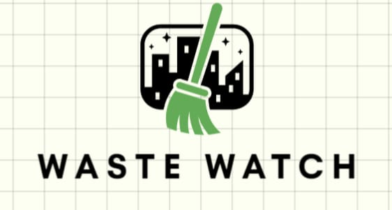

# WasteWatch AI Project


## Overview

WasteWatch is an AI project designed to efficiently sort waste using advanced machine learning techniques. The project comprises data processing, dataset creation, AI model development, and visualization of attribution methods to explain decision-making. The results are presented through a dedicated website.

## Project Structure

The project is organized into the following components:

- **Data Processing and Dataset Creation (WasteWatch1.ipynb):**
  - Jupyter notebook `WasteWatch1.ipynb` focuses on processing raw data and creating a comprehensive dataset for training the AI model. It covers data cleaning, preprocessing, and dataset generation.

- **AI Model Development and Attribution Methods (WasteWatch2.ipynb):**
  - Jupyter notebook `WasteWatch2.ipynb` is dedicated to building the AI model and implementing attribution methods. This includes training the model, evaluating performance, and visualizing attribution to enhance interpretability.

- **Website:**
  - The project includes a website for presenting the results and insights generated by WasteWatch. The website serves as a user-friendly interface to interact with the AI model and explore its capabilities.

- **Visualizations of Attribution Methods:**
  - The project includes visualizations that explain the attribution methods used in the AI model. These visualizations help users understand the decision-making process and gain insights into why certain decisions are made.

## Getting Started

To get started with the WasteWatch project, follow these steps:

1. Clone the repository:
   ```bash
   git clone https://github.com/your-username/wastewatch.git
   cd wastewatch
